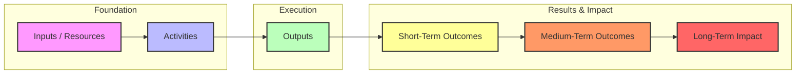

## Goals
{:.no_toc}

_This is a page for describing the goals of your working group. Some suggested options are below which may be helpful for organizing your thinking, but you don't have to use them!_

## Table of Contents 
{:.no_toc}
* TOC
{:toc}

## Science Traceability Matrix
A science traceability matrix can be a useful tool if your working group focuses on designing an instrument to address a scientific question.

| Science Goals | Science Objectives | Scientific Measurement Requirements | Scientific Measurement Requirements | Instrument Performance Requirements | Projected Instrument Performance | Mission Requirements (Top Level) |
| --- | --- | --- | --- | --- | --- | --- |
|  |  | **Observables** | **Physical parameters** |  |  |  |
| Goal 1 | Objective 1 | Absorption line | Column density of absorber | Alt. Range | XX km | ZZ km |
| Goal 2 |  | Emission line | Density and temperature of emitter | Alt. Range | XX km | ZZ km |
| Etc. |  | Morphological feature | Size of features | Vert. Resol. | XX km | ZZ km |
|  |  |  |  | Horiz. Resol. | XX deg x XX lat x XX long | ZZ deg x ZZ lat x ZZ long |
|  |  |  | Rise time of eruptive phenomenon | Temp. Resol. | XX min | ZZ min. |
|  |  |  |  | Precision | XX K | ZZ K |
|  |  |  | Rate of change of observable phenomenon | Accuracy | XX K | ZZ K |
|  | Objective 2 to N |  |  | Repeat above categories |  |  |

### Logic Model/Theory of Change
A [logic model](https://learning.nceas.ucsb.edu/2023-08-usgs/session_02.html) may be a good option if your group is focused on educational activities. 

| Logic Model Element | Logic Model Framing | Synthesis Research Framing |
| --- | --- | --- |
| **Problem Statement** | What is the problem? Why is this a problem? Who does this impact? | What is the current state of knowledge? What gaps exists in understanding? Why is more information / synthesis important? |
| **Inputs** | What resources are needed for the program (e.g. personnel, money, time, equipment, partnerships, etc.)? | What is needed to undertake the synthesis research? For personnel, think in terms of the roles that are needed (e.g. data manager, statistician, writer, editor etc.) Consider the time frame. Condsider what data are needed and what already exists? |
| **Outputs - Activities** | What will be done (e.g. development, design, workshops, conferences, counseling, outreach, etc.)? | What activities are needed to conduct the research? This could be high level or it could be broken down into details such as the types of statistical approaches. |
| **Outputs - Participants** | Who will we reach (e.g. clients, participants, customers, etc.)? | Who is the target audience? Who will be impacted by this work? Who is positioned to leverage this work? |
| **Outputs - Products** | What will you create (e.g. publications, websites, media communications, etc.)? | What research products are planned or expected? Consider this in relation to the intended audience. Is a peer-reviewed publication, report or white paper most appropriate? How will derived data be handled? Will documentation, workflows, or code be published? |
| **Outcomes - Short-term** | What short-term outcomes are anticipated among participants? These might include changes in awareness, knowledge, skills, attitudes, opinions or intent. | Will this work represent a significant contribution to current understanding? |
| **Outcomes - Medium-term** | What medium-term outcomes are predicted among participants? These might include changes in behaviors, decision-making and actions. | Will this work promote increased research activity or open new avenues of inquiry? |
| **Outcomes - Long-term** | What long-term benefits, or impacts, are expected? This might include changes in social, economic, civic, or environmental conditions. | Will this work result in local, regional or national policy change? What will be the long-term impact of increased investment in the ecosystem? |
